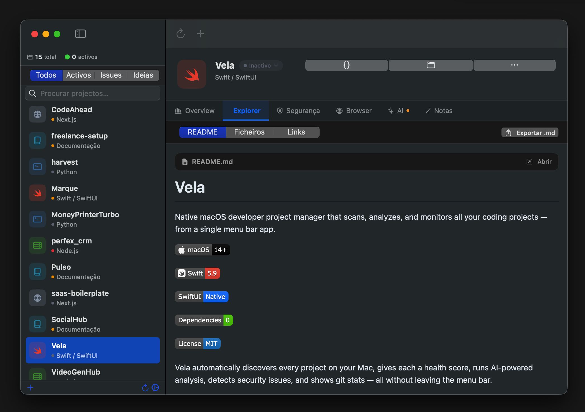

# Vela

Native macOS developer project manager that scans, analyzes, and monitors all your coding projects — from a single menu bar app.


Vela automatically discovers every project on your Mac, gives each a health score, runs AI-powered analysis, detects security issues, and shows git stats — all without leaving the menu bar.

**Zero external dependencies. Pure Apple frameworks.**

<p align="center">
  
</p>

---

## Download

| | |
|---|---|
| **Vela-1.0.0.dmg** | [Download Latest Release](https://github.com/devjoaocastro/vela/releases) |
| **Requirements** | macOS 14 (Sonoma) or later, Apple Silicon or Intel |
| **Size** | ~2.5 MB |

Or build from source:
```bash
git clone https://github.com/devjoaocastro/vela.git
cd vela && make install
```

---

## Screenshots

<p align="center">
  
</p>

---

## Features

**Project Discovery** — Automatically scans your Mac for coding projects. Detects 10+ project types: Swift, React Native, Next.js, Node.js, Python, Flutter, Rust, Static Sites, Documentation, and more.

**Vitality Score** — Every project gets a 0–100 health score based on git activity, remote presence, documentation quality, and uncommitted changes. Projects are classified as Active, Slow, Inactive, or Dead.

**Overview Dashboard** — Per-project overview with git info (last commit, total commits, branch, remote), recent commit timeline with author avatars, disk usage breakdown, language detection, and stack identification.

**Recent Activity** — Shows the last 15 commits with short hash, message, author, and relative date. Color-coded by commit type (fix, feature, refactor, docs).

**Explorer** — Full file tree with recursive directory loading, README rendering via WebKit with GitHub-style CSS, and one-click Markdown export.

**AI Analysis** — Ask AI about any project. Get structured verdicts (CONTINUA / ARQUIVA / REFACTORA / LANÇA) with summary, strengths, weaknesses, and next steps. Supports 5 providers:
- Apple Intelligence (on-device, zero cost)
- Ollama (local, free)
- Claude (Anthropic)
- OpenAI
- Google Gemini

**Security Scanning** — Detects exposed secrets (API keys, private keys, database URLs), tracked `.env` files, missing `.gitignore`, and other security issues across all your projects.

**Command Palette** — `⌘K` to open. Keyboard-driven project switcher with fuzzy search and arrow key navigation.

**Hide Projects** — Right-click any project to hide it from the sidebar. Excluded projects are remembered across sessions.

**Menu Bar App** — Lives in the macOS menu bar (sailboat icon). Always accessible, stays alive when the window is closed.

**Open in Editor** — One-click to open any project in VS Code, Cursor, Xcode, or Finder.

**Localization** — Full English and Portuguese (Portugal) support.

---

## Architecture

```
Sources/Vela/
├── VelaApp.swift                   App entry, menu bar, window management
├── AppState.swift                  State management, persistence, editor launching
├── Core/
│   ├── ProjectScanner.swift        Filesystem scanner, git enrichment, disk analysis
│   ├── LLMEngine.swift             Multi-provider LLM client + Keychain storage
│   ├── EmbeddedLLM.swift           Apple Intelligence + Ollama auto-detection
│   └── SecurityScanner.swift       Secret detection, git hygiene checks
├── Models/
│   └── Project.swift               Data models, vitality scoring, issue types
├── Resources/
│   ├── en.lproj/Localizable.strings
│   └── pt.lproj/Localizable.strings
└── UI/
    ├── DesignSystem.swift           Color utilities and shared styles
    └── Views/
        ├── ContentView.swift        NavigationSplitView root layout
        ├── SidebarView.swift        Project list with search and filters
        ├── ProjectDetailView.swift  Header + tabbed detail view
        ├── AIView.swift             AI analysis, chat, README generation
        ├── SecurityView.swift       Security findings dashboard
        ├── BrowserView.swift        Embedded WebKit browser
        ├── MarkdownWebView.swift    Markdown rendering via WebKit
        ├── CommandPaletteView.swift Keyboard-driven command palette
        ├── SettingsView.swift       LLM provider configuration
        └── NewProjectSheet.swift   Project creation wizard
```

---

## Requirements

- macOS 14 (Sonoma) or later
- Xcode 15+ or Swift 5.9+ (to build from source)
- For Apple Intelligence: macOS 26.0+ with compatible hardware
- For cloud AI: API keys for Claude, OpenAI, or Gemini (stored securely in macOS Keychain)

---

## Build & Run

```bash
# Debug build
make build

# Assemble .app bundle and open it
make run

# Release build + assemble .app bundle
make app-release

# Release build + install to /Applications
make install

# Clean build artifacts
make clean
```

Or directly with Swift Package Manager:

```bash
swift build -c release
```

---

## Tech Stack

| Layer      | Technology                                              |
|------------|---------------------------------------------------------|
| Language   | Swift 5.9                                               |
| UI         | SwiftUI                                                 |
| Build      | Swift Package Manager + Makefile                        |
| Storage    | JSON (`~/Library/Application Support/Vela/`)            |
| Security   | macOS Keychain (`Security.framework`)                   |
| Browser    | WebKit (`WKWebView`)                                    |
| AI         | FoundationModels + HTTP (Ollama, Claude, OpenAI, Gemini)|

**Zero external dependencies.** Pure Apple frameworks only.

---

## License

MIT — see [LICENSE](LICENSE) for details.

---

Built by [João Castro](https://joaocastro.online) — solo developer from Portugal.
